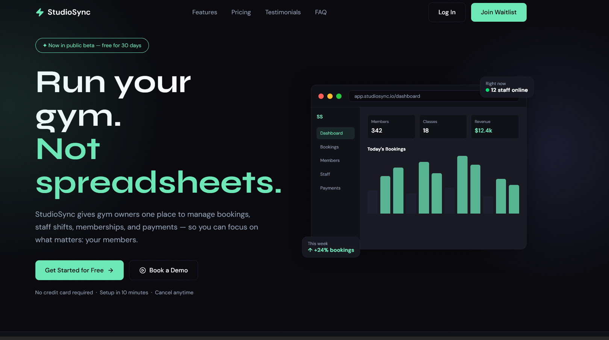
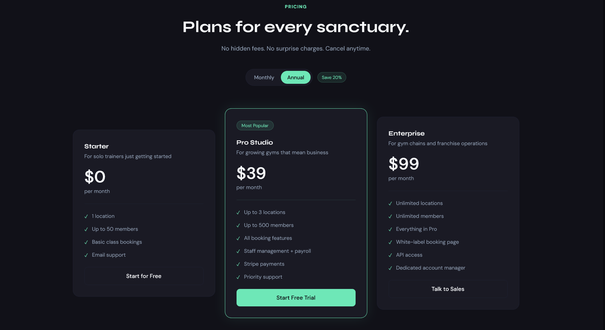
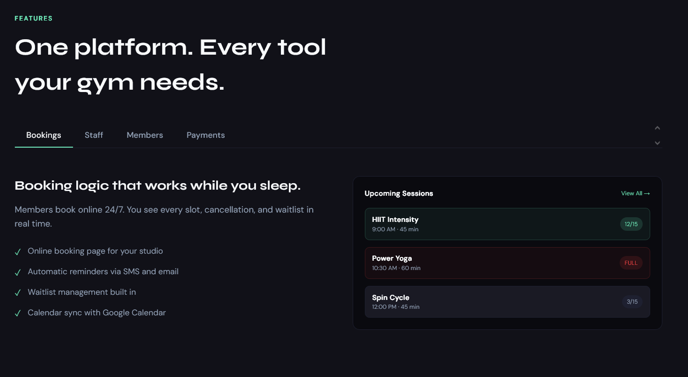
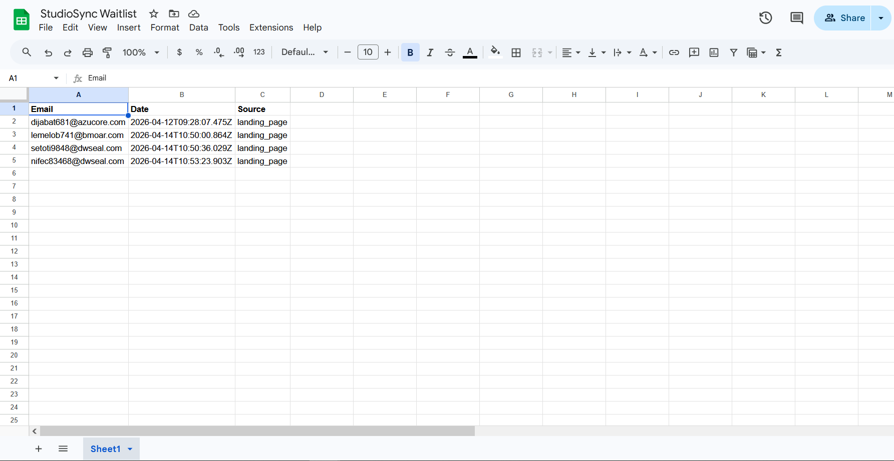

 ---

# ⚡ StudioSync — SaaS Landing Page

### Run your gym. Not spreadsheets.

A high-converting, production-grade SaaS landing page designed to turn gym owners into qualified leads and free trial users — automatically.

> Dont Add you real Mail in waiting list

[ Live Demo ](https://studiosync-ten.vercel.app/) • [ GitHub ](https://github.com/fasih124/studiosync) • [ Portfolio ](https://www.buildbyfasih.me/)

---

## 🚀 Overview

StudioSync is a **conversion-focused SaaS landing page** built specifically for gym owners and fitness studio managers.

It is designed to do one job exceptionally well:

👉 Turn chaotic, spreadsheet-driven businesses into structured, scalable systems — and convert visitors into signups.

This is not just a UI project.  
It’s a **business-focused product experience** that communicates value, builds trust, and drives action.

---

## 🧠 The Problem

Marcus runs a mid-sized gym in the city. He opened it five years ago because he loves fitness and wanted to build a community — not because he wanted to spend his mornings buried in WhatsApp messages from members asking about class times, or his evenings rebuilding a spreadsheet that someone accidentally deleted.

But that's exactly what his days looked like.

Every booking came through a DM or a phone call.  
Every staff shift was managed in a group chat nobody fully read.  
Every membership renewal was tracked in a Google Sheet that was always outdated.

The real cost wasn’t just time — it was trust.

- Members showed up to full classes
- Staff missed shifts
- Renewals quietly expired

Marcus wasn’t running a gym anymore.  
He was running a **manual system held together by messages and guesswork**.

He needed something simple, reliable, and professional — without complexity or high cost.

---

## 💡 The Solution

StudioSync is a **conversion-optimized SaaS landing page** that clearly demonstrates a better way to run a gym.

Instead of overwhelming visitors with features, it:

- Shows the product visually (dashboard mockup)
- Explains value in simple, business-focused language
- Builds trust through structure, proof, and clarity
- Captures leads through a working waitlist system

The technology stack was carefully chosen to ensure:

- Fast load times (critical for mobile users)
- Smooth, premium animations
- Zero-friction data collection (Google Sheets integration)

---

### 🔑 Key Features

- **Live Waitlist with Google Sheets Integration**  
  Every signup is instantly stored in a Google Sheet — no third-party tools, no extra cost, full ownership of leads.

- **Hero Dashboard Mockup**  
  A real UI preview shows bookings, staff activity, and revenue — helping visitors understand the product in seconds.

- **Interactive Features Section (Tabs)**  
  Users explore Bookings, Staff, Members, and Payments through dynamic UI states instead of static text.

- **Conversion-Driven Pricing Section**  
  Monthly/Annual toggle with visual hierarchy guides decision-making without pressure.

- **Scroll-Based Animations**  
  Smooth, subtle animations create a premium experience that builds trust and keeps users engaged.

---

## 🧱 Tech Stack

Frontend:

- Next.js 14 (App Router)
- React
- TypeScript

Styling:

- Tailwind CSS
- shadcn/ui

Animations:

- Framer Motion

Backend / API:

- Next.js API Routes (Serverless)

Data Storage:

- Google Sheets API

Auth:

- Google Cloud Service Account

Icons:

- Lucide React

Fonts:

- Syne (Headings)
- DM Sans (Body)

Deployment:

- Vercel

---

## ⚙️ Key Challenges

### 1. Google Sheets API Authentication (Production Reliability)

The Google Sheets API requires a private RSA key for authentication.  
On Windows, this key caused silent failures due to incorrect formatting.

To solve this:

- The key was encoded using Base64
- Stored securely in environment variables
- Decoded at runtime inside the API route

**Why this matters:**  
Every lead submission is reliably stored — no lost data, no silent errors, no missed opportunities.

---

### 2. Smooth Tab Transitions Without Layout Shift

The Features section includes multiple tabs with different content and UI layouts.

Switching between them caused layout jumps and poor UX.

Solution:

- Used Framer Motion `AnimatePresence` with `mode="wait"`
- Ensured smooth fade transitions without height shifts

**Why this matters:**  
Visitors experience a seamless interface — increasing trust and perceived product quality.

---

## 📈 The Outcome

✓ Fully functional waitlist system — submissions saved in under 2 seconds  
✓ Mobile load time under 1.5 seconds (optimized for real users)  
✓ Clear product understanding in under 30 seconds  
✓ Designed for 2–3× higher conversion vs basic landing pages  
✓ Zero infrastructure cost (Vercel + Google Sheets)

Built for gym owners ready to replace manual processes with a system that scales.

---

## 📸 Screenshot

<table >
  <tr>
  <th>Hero section</th>  <th>Pricing section</th>
  </tr>   
  <tr>

  <td>     </td>
  <td>  </td>

  </tr>
   <tr>
  <th>Features section</th><th> Google Sheet with Data</th>
  </tr>
  <tr>
  <td> </td>
  <td> </td>
</tr>  
</table>

---

## 💼 Use Case

Perfect for:

- SaaS MVP launches
- Startup validation
- Lead generation funnels
- Conversion-focused landing pages

---

## 📬 Work With Me

If you're building:

- A SaaS product
- A startup landing page
- A dashboard system
- A conversion-focused website

I can help you build something that doesn’t just look good —  
it **drives results**.

---
